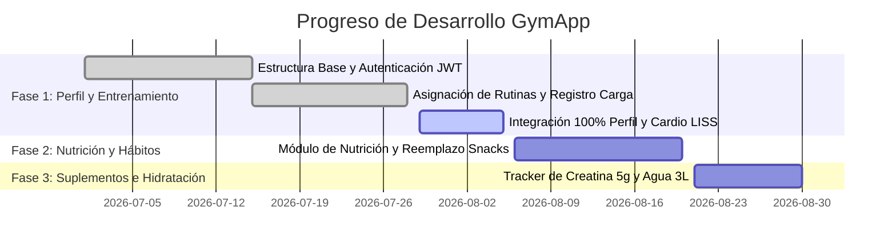

# 🚀 GEMINI.md - Visión General y Stack Tecnológico de GymApp

Bienvenido a **GymApp**, la plataforma integral de gestión de gimnasios, seguimiento de clientes, control de métricas físicas, asignación de rutinas personalizadas y seguimiento de recomposición corporal.

---

## 💻 Stack Tecnológico Global

### ⚙️ Backend Layer (`gymapp-back`)
- **Lenguaje / Runtime:** Java 21 (JDK 21)
- **Framework Principal:** Spring Boot 3.5.0
- **Persistencia & ORM:** Spring Data JPA / Hibernate
- **Base de Datos:** MySQL 8.x (vía `mysql-connector-j`)
- **Seguridad & Autenticación:** Spring Security con Tokens JWT (`jjwt-api` / `jjwt-impl` 0.11.5)
- **Validación de Datos:** Spring Boot Starter Validation (`@Valid`, `@NotNull`, `@Min`, etc.)
- **Generación de Reportes:** OpenPDF 2.0.3
- **Utilidades:** Lombok 1.18.36
- **Build Tool:** Apache Maven

### 🎨 Frontend Layer (`gym-frontend`)
- **Librería Core:** React 19.2.0
- **Lenguaje:** TypeScript 5.9.3
- **Build Tool & Dev Server:** Vite 7.2.4
- **Enrutamiento:** React Router DOM 7.11.0
- **Estilos & Diseño:** TailwindCSS 3.4.17 + PostCSS + Autoprefixer
- **Iconografía:** Lucide React 0.562.0
- **Formularios & Validación:** React Hook Form 7.69.0 + Zod 4.2.1 + `@hookform/resolvers`
- **Cliente HTTP:** Axios 1.13.2 con Interceptores JWT
- **Manejo de Estado Asíncrono:** TanStack React Query 5.90.12
- **Visualización de Datos:** Recharts 3.8.1 (Gráficos interactivos)
- **Notificaciones UI:** React Toastify 11.0.5

---

## 📈 Estado de Avance y Roadmap de Desarrollo

Actualmente el sistema cuenta con un **35% de cumplimiento global** respecto a la hoja de ruta integral de entrenamiento y nutrición.

---

## 🔗 Índice de Documentación Recomendada

- 🗺️ [**`SITEMAP.md`**](file:///home/agustin_dev/WorkSpace/gymapp/docs/SITEMAP.md) - Índice general de todos los documentos.
- 🛠️ [**`GEMINI` Backend**](file:///home/agustin_dev/WorkSpace/gymapp/gymapp-back/GEMINI.md) - Reglas y arquitectura Java/Spring Boot.
- 🎨 [**`GEMINI` Frontend**](file:///home/agustin_dev/WorkSpace/gymapp/gym-frontend/GEMINI.md) - Reglas y arquitectura React/TypeScript.
- 📋 [**Informe de Cumplimiento Inicial**](file:///home/agustin_dev/WorkSpace/gymapp/docs/INFORME_CUMPLIMIENTO_HOJA_DE_RUTA.md) - Estado de auditoría.
- 🟢 [**Plan BE Fase 1 (`2026-29-07-be-perfil-objetivo-entrenamiento.md`)**](file:///home/agustin_dev/WorkSpace/gymapp/docs/2026-29-07-be-perfil-objetivo-entrenamiento.md)
- 🟢 [**Plan FE Fase 1 (`2026-29-07-fe-perfil-objetivo-entrenamiento.md`)**](file:///home/agustin_dev/WorkSpace/gymapp/docs/2026-29-07-fe-perfil-objetivo-entrenamiento.md)
